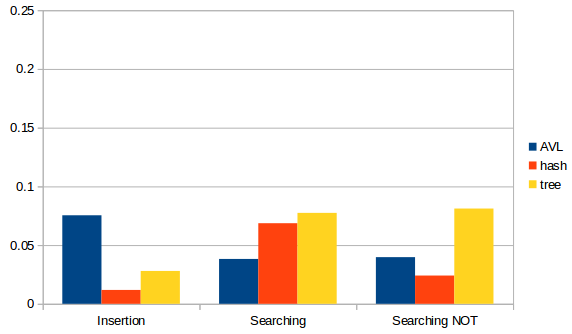
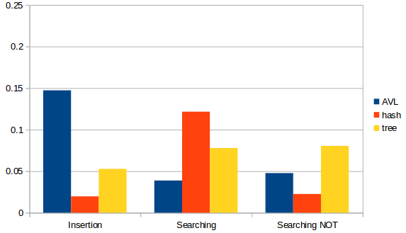
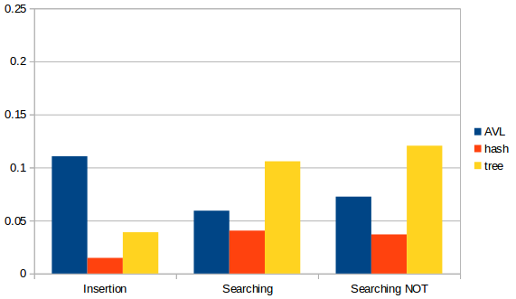
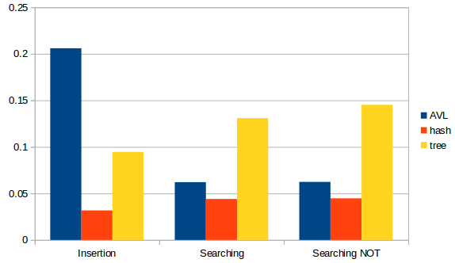

# Trees
Comparing naive binary tree, AVL tree, and hash table.

## Continuous Integration Status


## Installation
To use this package, you need to have Python3 in your environment. And the used packages are listed below.

### Used Packages
* os
* sys
* math
* time
* random
* argparse
* unittest
* pycodestyle

## Usage
`insert_key_value_pairs.py` is the main program for printing elasped time of insertion and searching by using specific data structures. Examples of using `insert_key_value_pairs.py`:

```bash
run test_normal python insert_key_value_pairs.py --data_structure hash --dataset rand.txt --data_number 1000
run test_normal python insert_key_value_pairs.py --data_structure AVL --dataset rand.txt --data_number 1000
run test_normal python insert_key_value_pairs.py --data_structure tree --dataset rand.txt --data_number 1000
```

The outputs of the program are
1. insertion time
2. searching time
3. searching time for keys not in the data structure

## Changes in this assignment
* Implemented basic binary tree with `insert` and `search` APIs
* Implemented AVL tree in `avl.py` with `insert` and `search` APIs
* Added corresponding tests for binary tree and avl tree in `test_binary_tree.py`
* Implemented `insert_key_value_pairs.py` to evaluate different data structures
* Added datasets
* Added functional tests in `test_insert_pairs.sh`
* Added `travis.yml` to conduct CI

## Results

*hash table: chained hash with h_ascii*

### Sorted

**Data Size: 4000**



**Data Size: 8000**



### Random

**Data Size: 4000**



**Data Size: 8000**



### Discussion
According to above graphs, we can find that
1. AVL tree is slow while insertion. Because while inserting elements, AVL tree needs to balancing itself by rotating nodes, its slow is predictable.
2. Searching time of AVL is much faster than naive binary tree while data size getting larger. Plus, searching time of AVL tree doesn't affect by random/sorted data, since it's a self-balancing tree.
3. Hash Table is the fastest data structure while using random data because it has O(1) complexity for all operations.
4. However, the searching is slowest for hash table while using sorted keys, because there are too many conflicts and each chain is long.
5. While using sorted keys, performance of binary tree is worse after increasing the size.